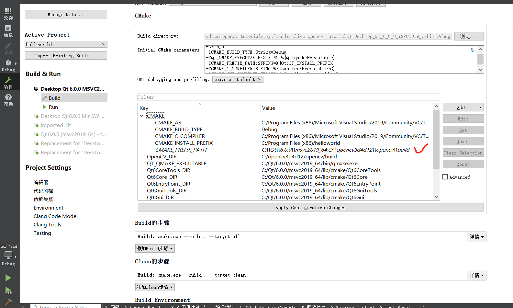

# clion-opencv-app
**《学习opencv3》** 书中代码

## 添加环境变量 ##
`C:\Qt\6.0.0\msvc2019_64\bin;C:\opencv3d4d12\opencv\build\x64\vc15\bin;`

## CMake编译构建 ##

- ### clion配置 ###
  - Preferences--->Build--->Toolchains，选择visual studio 2019编译器。
  - Preferences--->Build--->Cmake，在cmake options中输入：-D参数
  `-DCMAKE_PREFIX_PATH=C:\\Qt\\6.0.0\\msvc2019_64;C:\\opencv3d4d12\\opencv\\build`
  - 可以直接在clion里面配置环境变量，刷新掉老的。Edit Configurations--->
    - 或者Enviroment variables，
        `Path=C:\Qt\6.0.0\msvc2019_64\bin;C:\opencv3d4d12\opencv\build\x64\vc15\bin;`
    - 或者Working directory，
        `C:\Qt\6.0.0\msvc2019_64\bin;C:\opencv3d4d12\opencv\build\x64\vc15\bin;`
    - 或者直接找到clion 里面的Path环境变量覆盖。

- ### visual studio配置 ###
  - CMakeSettings.json
    ```json
    {
    "configurations": [
        {
        "name": "x64-Debug (默认值)",
        "generator": "Ninja",
        "configurationType": "Release",
        "inheritEnvironments": [ "msvc_x64_x64" ],
        "buildRoot": "${projectDir}\\out\\build\\${name}",
        "installRoot": "${projectDir}\\out\\install\\${name}",
        "cmakeCommandArgs": "-DCMAKE_PREFIX_PATH=C:\\Qt\\6.0.0\\msvc2019_64;C:\\opencv3d4d12\\opencv\\build",
        "buildCommandArgs": "",
        "ctestCommandArgs": ""
        }
    ]
    }
    ```
- ### Qt Creator配置 ###
  项目->构建设置->CMake，配置
  `CMAKE_PREFIX_PATH=C:\\Qt\\6.0.0\\msvc2019_64;C:\\opencv3d4d12\\opencv\\build`
  